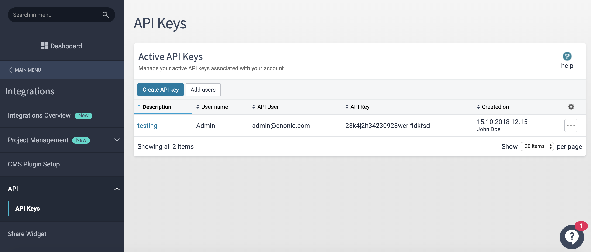
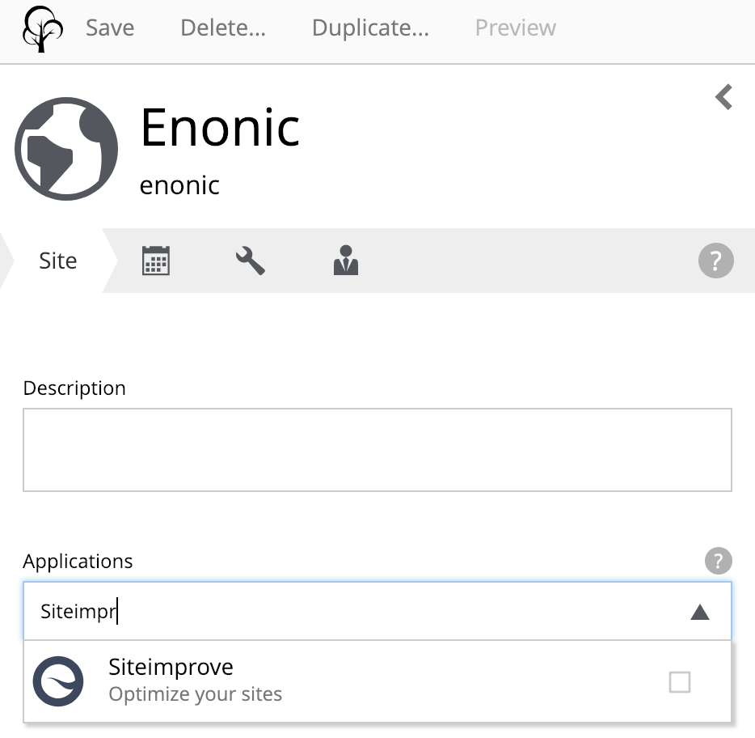
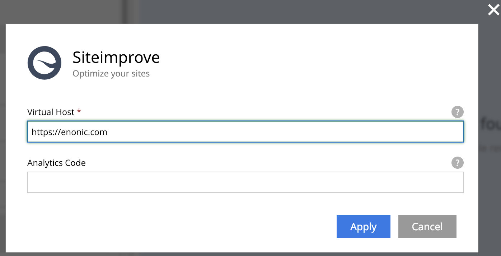
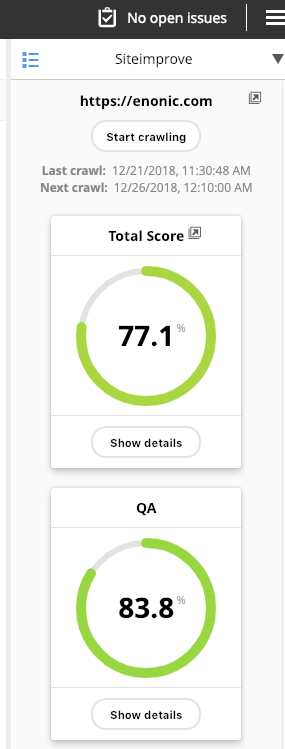
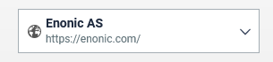
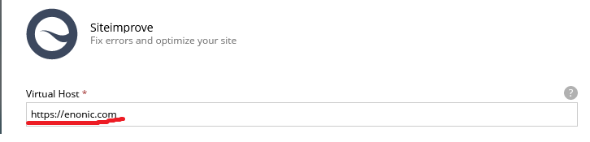

= Siteimprove for Enonic XP
:toc: right

== Introduction

NOTE: Versions 2.x target XP 8+.

Siteimprove for Enonic XP extends the administration console with Siteimprove statistics, error reports and improvement suggestions for the current page or site.

== Installation

Add the Siteimprove application to your XP installation and configure it with your Siteimprove API credentials as described below.

=== Configuring the app

. Make sure you have an account at Siteimprove.
. You will need two credentials to access the Siteimprove API: username and API token. They can be retrieved via the Siteimprove dashboard: in the Main Menu go to *Integrations > API > API Keys*. Click the *Create API key* button, select a user, and create the API key. It should appear in the table as shown below:
+

. Create a config file called `com.enonic.app.siteimprove.cfg` in the config folder of your XP installation.
. Add the email and API key from Siteimprove to this file, like this:
+
[source,properties]
----
siteimprove.apikey = 20394823rlkwjfwelfksd
siteimprove.username = admin@domain.com
----

. Build and deploy the app.
. Open Content Studio and add the Siteimprove app to your website:
+

. Open the site config dialog and set the virtual host of your website (with domain prefix). This will match pages of your website with Siteimprove data:
+

. If you need an analytics script on your pages, fill in the *Analytics Code* field in the same dialog.
. Save the changes and open the context panel for the site on the right-hand side of Content Studio. It should look something like this:
+

== Configure edit link from Siteimprove to Enonic XP

When you browse pages in Siteimprove you can jump directly into Enonic XP to fix errors. To accomplish this the Siteimprove app adds the `pageID` to the meta data on your site. This `pageID` helps Siteimprove open the right content for editing.

This is how the `pageID` looks:

[source,html]
----
<meta name="pageID" content="xxxxx">
----

To configure Siteimprove, click the *CMS integrasjon* link in the middle of the header when you browse a page in Siteimprove, then fill in the form.

== Troubleshooting

=== Error: "Site" is not enabled for your Siteimprove account

If this message pops up in the UI, the Virtual Host does not match the site configured in Siteimprove:

