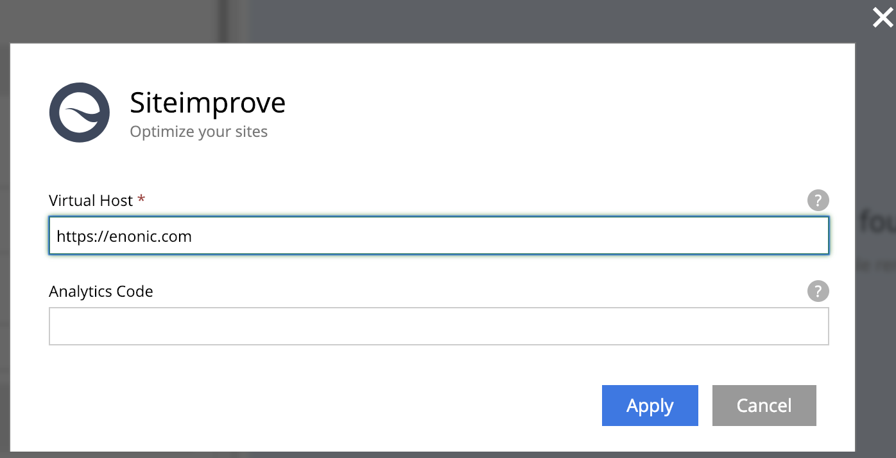

## Configuring the app

1.Make sure you have an account at Siteimprove

2.You will need two credentials to access the Siteimprove API: username and API token. 
They can be retrieved via Siteimprove dashboard: in the Main Menu go to Integrations > API > API Keys.
Click "Create API key" button, select user and create the API key. It should appear in the table as shown below:


3.Create a config file called `com.enonic.app.siteimprove.cfg` in the config folder of your XP installation

4.Add the email and API key from Siteimprove to this file, like this:
```
siteimprove.apikey = 20394823rlkwjfwelfksd

siteimprove.username = admin@domain.com
```

5.Build and deploy the app

6.Open Content Studio and add the Siteimprove app to your website


7.Open the site config dialog and set virtual host of your website (with domain prefix). This will match pages of your 
website with Siteimprove data.



8.If you need analytics script on your pages, fill in the "Analytics Code" field in the same dialog

9.Save the changes and open the context panel for the site on the right-hand side of the Content Studio. 
It should look something like this:


## Configure edit link from Siteimprove to Enonic XP

When you browse pages in Siteimprove you can jump directly into Enonic XP to fix errors. To accomplish this the Siteimprove app adds the pageID to the meta data on your site. This pageID will help Siteimprove open the right content for editing.

This is how the pageID looks:
```
<meta name="pageID" content="xxxxx">
```

To configure Siteimprove you can click on the "CMS integrasjon" link in the middle of the header when you browse a page in Siteimprove. Then you fill in the form.

## Error: "Site" is not enabled for your Siteimprove account.

If this messages pops up in the UI then the Virtual Host is not the same in SiteImprove:


